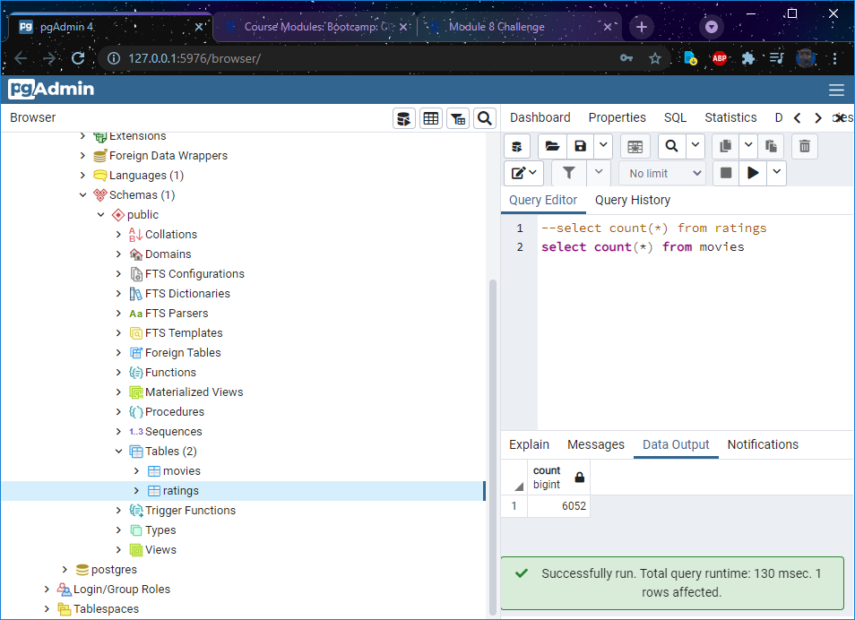
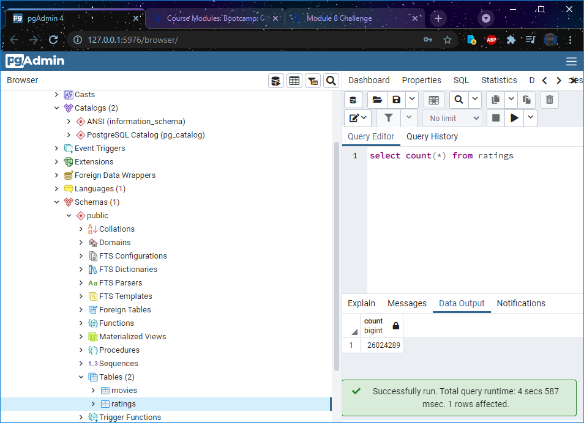

# Movies-ETL

CU-VIRT-DATA-PT-02-2021-U-B-TTH - Use ETL to Collect, Import, and Process Data - 08  

Paul Do 2021-04-12

## Resources

1. The [`ETL_function_test.ipynb`](ETL_function_test.ipynb) file

2. The [`ETL_clean_wiki_movies.ipynb`](ETL_clean_wiki_movies.ipynb) file

3. The [`ETL_clean_kaggle_data.ipynb`](ETL_clean_kaggle_data.ipynb) file

4. The [`ETL_create_database.ipynb`](ETL_create_database.ipynb) file

5. The Resources folder with the [`wikipedia-movies.json`](Resources/wikipedia-movies.json), [`movies_metadata.csv`](Resources/movies_metadata.csv), [`ratings.csv`](Resources/ratings.csv), `movies_query.png`, and `ratings_query.png` files

movies_query:
   
ratings_query:
   

## Purpose

Develop skills to Use ETL to Collect, Import, and Process Data through Python, Jupyter Notebooks and to Postgres.

## Summary

SQL load via CSV takes quit a bit of time.